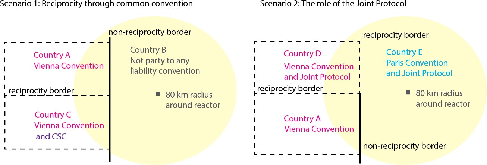

## Background

- Nuclear liability is unique: accidents are extraordinarily rare but potentially massive in scale, trans-boundary, and long-lived. Standard tort law is inadequate for swift victim compensation
- Nuclear energy is expanding into new countries and applications, extending to emerging economies in Southeast Asia and sub-Saharan Africa1–5 and even novel uses like maritime power and AI infrastructure
- Liability channeling concentrates all accident liability on the reactor operator15,16, shielding suppliers, designers, and manufacturers from direct legal claims. It's a framework designed in the 1950s17 for a nascent, nationally-contained industry
- As the industry globalizes, the adequacy of liability channeling is being questioned: do decades-old legal tools still serve a rapidly evolving, multi-country supply chain?

::: {.slide-refs}
1 Bertel & Van de Vate (1995). Nuclear energy & the environmental debate. IAEA Bulletin. · 2 McMillan et al. (2016). Generation and use of thermal energy in the U.S. industrial sector. NREL. · 3 Bataille et al. (2018). Deep decarbonization pathway options for energy-intensive industry. J. Cleaner Production, 187. · 4 Åhman et al. (2013). Industrial development towards net zero emissions. IMES/DESS Report No. 88. · 5 Lechtenböhmer et al. (2016). Decarbonising the energy intensive basic materials industry. Energy, 115. · 15 Osaka (2012). Corporate liability, government liability, and the Fukushima nuclear disaster. Pacific Rim Law & Policy Journal, 21(3). · 16 OECD (2012). Japan's Compensation System for Nuclear Damage. OECD Publishing. · 17 Holt (2025). Price-Anderson Act: Nuclear power industry liability limits. CRS IF10821.
:::

## Context & My Contribution

::: {.columns}
::: {.column width="54%"}
*The Problem*

- Countries operate under incompatible liability regimes, creating variance in domestic law among countries and uncertainty in compensation of nuclear damage27
- Mature nuclear economies including China and South Korea are still not party to any nuclear liability conventions16,17,23–26, and reciprocity gaps persist even among neighbors
- Without global uniformity, supply chain development faces legal and financial risks that will shape innovation and investment.

*Our Approach*

- Cross-disciplinary analysis combining nuclear law and geospatial science to quantify where legal gaps exist and how many people are exposed

*Proposed Policy Outcome*

- Local and international legal frameworks must seek global uniformity and cross-border reciprocity
- Liability frameworks can evolve toward or away from channeling, so long as these two conditions are met
- The process is not a priori costly, but slow: reciprocity must be resolved before plants obtain their license to operate
:::

::: {.column width="6%"}
:::

::: {.column width="40%"}
*My Contributions*

- Classified every country by nuclear liability convention membership and computed reciprocity status across all international borders
- Designed and executed the 80 km ingestion-pathway buffer analysis around all 419 active reactor locations worldwide
- Overlaid NASA GPWv435 gridded population data to quantify the number of people living within legal coverage gaps
- Identified and characterized specific high-risk border segments by reactor proximity and population exposure
- Produced Figures 2 and 3 for publication: global maps of convention membership, border-by-border reciprocity, reactor locations, and population density
:::
:::

::: {.slide-refs}
16 OECD (2012). Japan's Compensation System for Nuclear Damage. OECD Publishing. · 17 Holt (2025). Price-Anderson Act. CRS IF10821. · 23 NEA (1997). Convention on Supplementary Compensation for Nuclear Damage (CSC). · 24 NEA (1960). Paris Convention: Latest status of ratifications or accessions. · 25 IAEA (2024). Status of the Vienna Convention on Civil Liability for Nuclear Damage. · 26 IAEA. Brussels Convention Supplementary to the Paris Convention. · 27 INLEX/IAEA. Civil Liability for Nuclear Damage: Advantages and Disadvantages of Joining the International Nuclear Liability Regime. · 35 CIESIN/Columbia University. Gridded Population of the World, Version 4 rev11 (GPWv4). NASA SEDAC.
:::

## Figure 1 · Nuclear Liability Amounts by Regime

{width="85%"}

::: {.figure-caption}
Nuclear liability amounts under different liability regimes vs. actual damages from Three Mile Island (1979) and Fukushima (2011). Government is insurer of last resort in all cases.16,17,23–26
:::

::: {.slide-refs}
16 OECD (2012). Japan's Compensation System for Nuclear Damage. OECD Publishing. · 17 Holt (2025). Price-Anderson Act. CRS IF10821. · 23 NEA (1997). CSC. · 24 NEA (1960). Paris Convention: Latest status of ratifications or accessions. · 25 IAEA (2024). Status of the Vienna Convention on Civil Liability for Nuclear Damage. · 26 IAEA. Brussels Convention Supplementary to the Paris Convention.
:::

## Comparison of International Nuclear Liability Conventions

| Convention | Year | Region / Scope | Liability Limit | Key Feature |
|:------------|:-|:-----------|:------------|:-------------------------------|
| **Paris Convention** | 1960 | Western Europe | ~USD 21M (orig.) | Legal channeling to operator; suppliers shielded from direct claims by statute24 |
| **Vienna Convention** | 1963 | Eastern Europe | ~USD 5M (orig.) | Strict & exclusive operator liability; victim need not prove fault or identify responsible party25 |
| **Joint Protocol** | 1988 | Paris + Vienna parties | N/A (bridge) | Bridges Paris & Vienna signatories, creating reciprocity for transboundary claims between the two regimes18,49 |
| **Brussels Supp.** | 1963 | Paris Conv. states | ~EUR 1.5B (revised) | Adds a multi-tier supplementary compensation fund beyond the operator's primary coverage for Paris Convention states26,50 |
| **Convention on Supplementary Compensation** | 1997 | Intended global | ~USD 600M+ | Intended as a global unifying regime; establishes an international fund pooled from contributions of all contracting states23,44 |
| **US Price-Anderson** | 1957 | United States | ~USD 17B (total) | Two-tier system: $500M primary private insurance per site + ~$16B secondary pool funded collectively by all 94 licensed US reactor operators17 |

::: {.data-sources}
Data sources: Paris Convention (1960) · Vienna Convention (1963) · Joint Protocol (1988) · CSC (1997) · US Price-Anderson Act (1957)
:::

::: {.slide-refs}
17 Holt (2025). Price-Anderson Act. CRS IF10821. · 18 IAEA (1988). The Joint Protocol Relating to the Application of the Vienna Convention and the Paris Convention. · 23 NEA (1997). CSC. · 24 NEA (1960). Paris Convention: Latest status of ratifications or accessions. · 25 IAEA (2024). Status of the Vienna Convention on Civil Liability for Nuclear Damage. · 26 IAEA. Brussels Convention Supplementary to the Paris Convention. · 44 Percebois & Thiolliere (2024). Nuclear Economy 2: Nuclear Issues in the Energy Transition. Wiley. · 49 IAEA (2024). Status of the Joint Protocol. · 50 OECD NEA. Brussels Convention Supplementary to the Paris Convention.
:::

## Reciprocity Scenarios — How Border Classification Works

{width="90%"}

::: {.figure-caption}
Reciprocity is determined by whether neighboring countries are party to compatible nuclear liability conventions. The 80 km reactor buffer is the NRC ingestion-pathway radius.
:::

## Methods

::: {.columns}
::: {.column width="32%"}
**Data Sources**

- Reactor locations & operational status: IAEA Power Reactor Information System (PRIS)31, as of end of 2024; geographical coordinates obtained via GeoHack32
- Convention membership: OECD NEA and IAEA Office of Legal Affairs — countries that "ratified, acceded, accepted, or approved" the VC, PC, JP, BSC, and CSC23–26,48–50
- Country borders & boundaries: Esri World Countries (Data and Maps)
- Population: NASA Gridded Population of the World v4 rev11 (GPWv4)35
:::

::: {.column width="2%"}
:::

::: {.column width="32%"}
**Analysis**

- ArcGIS Pro v3.40 used to generate all maps; projections: Times (global) and a customized Albers centered on continental Europe
- Border-by-border reciprocity computed from convention membership to identify types of conventions and reciprocity across borders
- 80 km (50 mi) buffer radius around all reactor sites — the US NRC-recommended Ingestion Exposure Pathway Emergency Planning Zone51,52 for light water reactors
- Population overlay applied within buffers and within 80 km of all international borders
:::

::: {.column width="2%"}
:::

::: {.column width="32%"}
**Caveats**

- The 80 km EPZ can be smaller depending on reactor-design-specific radiologic source term
- Economic damages can extend well beyond the local vicinity of plants (e.g. South Korean fishing industry post-Fukushima55,56, Italian and UK farmers post-Chernobyl57)
- Population counts near multiple borders may double-count individuals
:::
:::

::: {.slide-refs}
23 NEA (1997). CSC. · 24 NEA (1960). Paris Convention: Latest status. · 25 IAEA (2024). Status of the Vienna Convention. · 26 IAEA. Brussels Convention Supplementary to the Paris Convention. · 31 IAEA (2025). Power Reactor Information System (PRIS). https://pris.iaea.org · 32 GeoHack. https://geohack.toolforge.org · 35 CIESIN/Columbia University. GPWv4. NASA SEDAC. · 48 CSC, Article II.1 (1997). · 49 IAEA (2024). Status of the Joint Protocol. · 50 OECD NEA. Brussels Convention Supplementary to the Paris Convention. · 51 Collins et al. (1978). Planning basis for radiological emergency response plans. US NRC NUREG-0396. · 52 10 CFR § 50.47 Emergency plans. US NRC. · 55 Liu & Hoskin (2023). Regulating the Fukushima wastewater discharge. Ocean & Coastal Management, 234. · 56 Yuan et al. (2024). Japan's nuclear wastewater release on South Korean fishery. Marine Policy, 163. · 57 Malone (1987). The Chernobyl accident: A case study in international law. Columbia J. Environmental Law.
:::

## Figure 2 · Liability Conventions, Reciprocity & Reactor Locations {.has-map data-slide-key="fig2"}

## Figure 3 · Transboundary Reciprocity, Reactor Locations & Population Density {.has-map data-slide-key="fig3"}

## Table 1 · Border Areas & Populations Affected by Reciprocity

<table class="data-table">
<thead>
  <tr><th>Area</th><th># Reactors</th><th>Population (80km)</th><th>Significance</th></tr>
</thead>
<tbody>
  <tr><td>All 419 reactor locations</td><td>419</td><td>542M</td><td>All people within ingestion-pathway radius of any reactor (upper bound)</td></tr>
  <tr><td>80-km radii overlapping borders WITH reciprocity</td><td>82</td><td>23M</td><td>Regions with reactors that address transboundary damage</td></tr>
  <tr class="highlight-row"><td>80-km radii overlapping borders WITHOUT reciprocity</td><td>26</td><td class="red-val">1.9M</td><td>Populations that may not be able to make claims across borders</td></tr>
  <tr class="section-header-row"><td><strong>Border Length Analysis</strong></td><td><strong>Border Length</strong></td><td><strong>Pop. within 80km of border</strong></td><td><strong>Notes</strong></td></tr>
  <tr><td>All country borders</td><td>127,000 km</td><td>4,100M</td><td>All populations near any international border</td></tr>
  <tr><td>Borders WITH reciprocity (e.g. France–Germany)</td><td>56,000 km</td><td>3,300M</td><td></td></tr>
  <tr class="highlight-row"><td><strong>Borders WITHOUT reciprocity (e.g. Russia–Finland)</strong></td><td><strong>71,000 km</strong></td><td class="red-val"><strong>800M</strong></td><td></td></tr>
  <tr class="sub-row"><td>· Diff. conventions (e.g. Russia–Finland)</td><td>4,400 km</td><td>750M</td><td>Both parties to conventions, but incompatible</td></tr>
  <tr class="sub-row"><td>· One country has convention (e.g. India–China)</td><td>14,000 km</td><td>160M</td><td>Immediate risk for siting new reactors near borders</td></tr>
  <tr class="sub-row"><td>· Neither has convention, one has nuclear power</td><td>19,000 km</td><td>250M</td><td>Future deployment risk</td></tr>
</tbody>
</table>

::: {.data-sources}
Table 1: Geospatial analysis results.31,35 Highlighted rows are the critical gap. \*Population counts may double-count individuals near multiple borders.
:::

::: {.slide-refs}
31 IAEA (2025). Power Reactor Information System (PRIS). https://pris.iaea.org · 35 CIESIN/Columbia University. Gridded Population of the World, Version 4 rev11 (GPWv4). NASA SEDAC.
:::

## Table 3 · Fukushima Litigation — Liability Amounts in Context

| Year | Parties | Nature of Claim | Venue | Settlement / Liability |
|:--|:--|:--|:--|:--|
| 2011 | Fukushima victims (3,700) vs. TEPCO | Economic damage | Supreme Court of Japan | USD 12 million |
| 2012 | TEPCO shareholders vs. executives | Negligence / failure to act | Tokyo High Court | USD 97 billion personal liability (executives to TEPCO) |
| 2020 | U.S. service members vs. TEPCO | Radiation exposure | US Federal Court | Dismissed — adequate remedy in Japan |
| 2023 | Fishermen & residents of Fukushima | Halt wastewater release | Fukushima District Court | Unresolved |

::: {.key-point}
**Key point:** Total Fukushima damage exceeded $200B42,43. Max insured amount under any regime: ~$17B16,17,23–26. Government is insurer of last resort by design.
:::

::: {.data-sources}
Table 3: Selected litigation arising from the 2011 Fukushima Dai-ichi accident. Illustrates the scale of potential damages relative to capped liability amounts.
:::

::: {.slide-refs}
16 OECD (2012). Japan's Compensation System for Nuclear Damage. OECD Publishing. · 17 Holt (2025). Price-Anderson Act. CRS IF10821. · 23 NEA (1997). CSC. · 24 NEA (1960). Paris Convention: Latest status. · 25 IAEA (2024). Status of the Vienna Convention. · 26 IAEA. Brussels Convention Supplementary to the Paris Convention. · 42 OECD NEA (2014). Progress towards a Global Nuclear Liability Regime. Nuclear Law Bulletin, 93. · 43 National Research Council (2014). Lessons Learned from the Fukushima Nuclear Accident. National Academies Press.
:::

## Key Findings

71,000 kmof international borders (56%) have no nuclear liability reciprocity

1.9 millionpeople live within 80 km of a reactor that crosses a non-reciprocal border

26 reactorscurrently have 80 km radii overlapping borders with no reciprocity31,35

China, S. Korea, Taiwan, Iran, Pakistan— all non-party to any convention; most of East/South Asia in a legal void

Fukushima ($200B+)dwarfed max insured amounts ($17B at best, &lt;$2B in most regimes)16,17,23–26,42,43

::: {.slide-refs}
16 OECD (2012). Japan's Compensation System for Nuclear Damage. OECD Publishing. · 17 Holt (2025). Price-Anderson Act. CRS IF10821. · 23 NEA (1997). CSC. · 24 NEA (1960). Paris Convention: Latest status. · 25 IAEA (2024). Status of the Vienna Convention. · 26 IAEA. Brussels Convention Supplementary to the Paris Convention. · 31 IAEA (2025). PRIS. https://pris.iaea.org · 35 CIESIN/Columbia University. GPWv4. NASA SEDAC. · 42 OECD NEA (2014). Progress towards a Global Nuclear Liability Regime. Nuclear Law Bulletin, 93. · 43 National Research Council (2014). Lessons Learned from the Fukushima Nuclear Accident. National Academies Press.
:::

## Takeaways

1. The geospatial framework, buffering all 419 reactor sites and computing border-by-border reciprocity with population overlays, provides a scalable and repeatable method to identify where legal gaps exist and who is most exposed. As new fission reactor designs and fusion systems are deployed globally, this spatial framework can be reapplied to track evolving legal exposure in near-real-time.

2. 71,000 km (56%) of global borders have no nuclear liability reciprocity; 1.9 million people live within 80 km51,52 of a reactor crossing one of those borders with no guaranteed legal avenue for compensation.

3. The government is insurer of last resort in all regimes, yet Fukushima's damages exceeded $200B, dwarfing the $17B maximum insured under even the best available convention framework.

4. Liability frameworks can evolve toward or away from channeling; Alternatives are workable, but require new institutional and insurance infrastructure.

5. Establishing global uniformity is not a priori costly, but a slow process" — countries importing, exporting, or operating new plants bear responsibility for resolving reciprocity before plants obtain their license to operate.

::: {.slide-refs}
51 Collins et al. (1978). Planning basis for radiological emergency response plans. US NRC NUREG-0396. · 52 10 CFR § 50.47 Emergency plans. US NRC.
:::

::: {.slide-footer}
*Work in progress — feedback welcome*

Benjamin O. Szeghy · benjamin.szeghy@berkeley.edu · Geography Dept., UC Berkeley
:::
