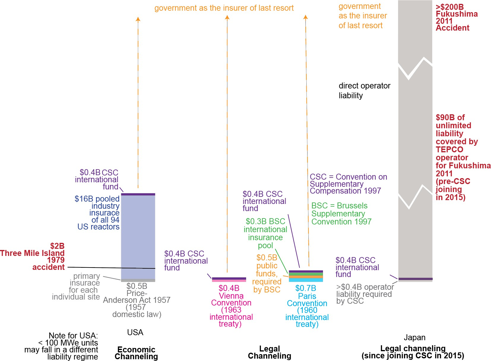

## Background

- Nuclear liability is unique: accidents are extraordinarily rare but potentially massive in scale, trans-boundary, and long-lived. Standard tort law is inadequate for swift victim compensation
- Nuclear energy is expanding into new countries and applications, extending to emerging economies in Southeast Asia and sub-Saharan Africa and even novel uses like maritime power and AI infrastructure
- Liability channeling concentrates all accident liability on the reactor operator, shielding suppliers, designers, and manufacturers from direct legal claims. It's a framework designed in the 1950s for a nascent, nationally-contained industry
- As the industry globalizes, the adequacy of liability channeling is being questioned: do decades-old legal tools still serve a rapidly evolving, multi-country supply chain?

## Context & My Contribution

::: {.columns}
::: {.column width="47%"}
**Paper thesis**

- Nuclear liability law is fragmented globally — no reciprocity across 71,000 km (56%) of international borders.
- New reactor types, new markets, and new business models require updated liability frameworks.
- Global uniformity and cross-border reciprocity are necessary for investment and victim protection.
:::

::: {.column width="6%"}
:::

::: {.column width="47%"}
**My contributions (Geography Dept.)**

- Classified all countries by nuclear liability convention membership
- Computed reciprocity status for every international border segment
- 80 km buffer analysis around all 419 reactor locations
- Population overlay to quantify people in legal gaps
- Produced Figures 2 & 3 (maps) for publication
:::
:::

::: {.data-sources}
Data sources: IAEA PRIS · NEA/IAEA Nuclear Law Handbook · Natural Earth · GPW population grid · UN Treaty Collection
:::

## Figure 1 · Nuclear Liability Amounts by Regime

{width="85%"}

::: {.figure-caption}
Figure 1: Nuclear liability amounts under different liability regimes vs. actual damages from Three Mile Island (1979) and Fukushima (2011). Government is insurer of last resort in all cases.
:::

## Comparison of International Nuclear Liability Conventions

| Convention | Year | Region / Scope | Liability Limit | Key Feature |
|:------------|:-|:-----------|:------------|:-------------------------------|
| **Paris Convention** | 1960 | Western Europe | ~USD 21M (orig.) | Legal channeling to operator; suppliers shielded from direct claims by statute |
| **Vienna Convention** | 1963 | Eastern Europe | ~USD 5M (orig.) | Strict & exclusive operator liability; victim need not prove fault or identify responsible party |
| **Joint Protocol** | 1988 | Paris + Vienna parties | N/A (bridge) | Bridges Paris & Vienna signatories, creating reciprocity for transboundary claims between the two regimes |
| **Brussels Supp.** | 1963 | Paris Conv. states | ~EUR 1.5B (revised) | Adds a multi-tier supplementary compensation fund beyond the operator's primary coverage for Paris Convention states |
| **Convention on Supplementary Compensation** | 1997 | Intended global | ~USD 600M+ | Intended as a global unifying regime; establishes an international fund pooled from contributions of all contracting states |
| **US Price-Anderson** | 1957 | United States | ~USD 17B (total) | Two-tier system: $500M primary private insurance per site + ~$16B secondary pool funded collectively by all 94 licensed US reactor operators |

::: {.data-sources}
Data sources: Paris Convention (1960) · Vienna Convention (1963) · Joint Protocol (1988) · CSC (1997) · US Price-Anderson Act (1957)
:::

## Reciprocity Scenarios — How Border Classification Works

  <strong>Image needed:</strong> Export <code>fig_scenarios.png</code> from page 5 of the PDF and save it alongside <code>index.qmd</code>, then replace this block with <code>{width="90%"}</code>

::: {.figure-caption}
Reciprocity is determined by whether neighboring countries are party to compatible nuclear liability conventions. The 80 km reactor buffer is the NRC ingestion-pathway radius.
:::

## Figure 2 · Liability Conventions, Reciprocity & Reactor Locations {.has-map data-slide-key="fig2"}

## Figure 3 · Transboundary Reciprocity, Reactor Locations & Population Density {.has-map data-slide-key="fig3"}

## Table 1 · Border Areas & Populations Affected by Reciprocity

<table class="data-table">
<thead>
  <tr><th>Area</th><th># Reactors</th><th>Population (80km)</th><th>Significance</th></tr>
</thead>
<tbody>
  <tr><td>All 419 reactor locations</td><td>419</td><td>542M</td><td>All people within ingestion-pathway radius of any reactor (upper bound)</td></tr>
  <tr><td>80-km radii overlapping borders WITH reciprocity</td><td>82</td><td>23M</td><td>Regions with reactors that address transboundary damage</td></tr>
  <tr class="highlight-row"><td>80-km radii overlapping borders WITHOUT reciprocity</td><td>26</td><td class="red-val">1.9M</td><td>Populations that may not be able to make claims across borders</td></tr>
  <tr class="section-header-row"><td><strong>Border Length Analysis</strong></td><td><strong>Border Length</strong></td><td><strong>Pop. within 80km of border</strong></td><td><strong>Notes</strong></td></tr>
  <tr><td>All country borders</td><td>127,000 km</td><td>4,100M</td><td>All populations near any international border</td></tr>
  <tr><td>Borders WITH reciprocity (e.g. France–Germany)</td><td>56,000 km</td><td>3,300M</td><td></td></tr>
  <tr class="highlight-row"><td><strong>Borders WITHOUT reciprocity (e.g. Russia–Finland)</strong></td><td><strong>71,000 km</strong></td><td class="red-val"><strong>800M</strong></td><td></td></tr>
  <tr class="sub-row"><td>· Diff. conventions (e.g. Russia–Finland)</td><td>4,400 km</td><td>750M</td><td>Both parties to conventions, but incompatible</td></tr>
  <tr class="sub-row"><td>· One country has convention (e.g. India–China)</td><td>14,000 km</td><td>160M</td><td>Immediate risk for siting new reactors near borders</td></tr>
  <tr class="sub-row"><td>· Neither has convention, one has nuclear power</td><td>19,000 km</td><td>250M</td><td>Future deployment risk</td></tr>
</tbody>
</table>

::: {.data-sources}
Table 1: Geospatial analysis results. Highlighted rows are the critical gap. \*Population counts may double-count individuals near multiple borders.
:::

## Table 3 · Fukushima Litigation — Liability Amounts in Context

| Year | Parties | Nature of Claim | Venue | Settlement / Liability |
|:--|:--|:--|:--|:--|
| 2011 | Fukushima victims (3,700) vs. TEPCO | Economic damage | Supreme Court of Japan | USD 12 million |
| 2012 | TEPCO shareholders vs. executives | Negligence / failure to act | Tokyo High Court | USD 97 billion personal liability (executives to TEPCO) |
| 2020 | U.S. service members vs. TEPCO | Radiation exposure | US Federal Court | Dismissed — adequate remedy in Japan |
| 2023 | Fishermen & residents of Fukushima | Halt wastewater release | Fukushima District Court | Unresolved |

::: {.key-point}
**Key point:** Total Fukushima damage exceeded $200B. Max insured amount under any regime: ~$17B. Government is insurer of last resort by design.
:::

::: {.data-sources}
Table 3: Selected litigation arising from the 2011 Fukushima Dai-ichi accident. Illustrates the scale of potential damages relative to capped liability amounts.
:::

## Key Findings

  

    71,000 km
    of international borders (56%) have no nuclear liability reciprocity
  

  

    1.9 million
    people live within 80 km of a reactor that crosses a non-reciprocal border
  

  

    26 reactors
    currently have 80 km radii overlapping borders with no reciprocity
  

  

    China, S. Korea, Taiwan, Iran, Pakistan
    — all non-party to any convention; most of East/South Asia in a legal void
  

  

    Fukushima ($200B+)
    dwarfed max insured amounts ($17B at best, &lt;$2B in most regimes)
  

## Takeaways

1. The geospatial framework — buffering all 419 reactors, computing border-by-border reciprocity, and overlaying population — provides a scalable, repeatable method to monitor the global liability gap.

2. 56% of global borders are unprotected. The maps show specifically where, and which bilateral gaps are highest priority given reactor proximity and population exposure.

3. Establishing reciprocity is slow (national law, bilateral agreements, convention ratification) but not expensive. The data can help focus diplomatic effort.

4. As new reactor types (SMRs, fusion) are deployed globally, this spatial framework can be re-run in near-real-time to track evolving exposure.

::: {.slide-footer}
*Work in progress — feedback welcome*

Benjamin O. Szeghy · bszeghy@berkeley.edu · Geography Dept., UC Berkeley
:::
